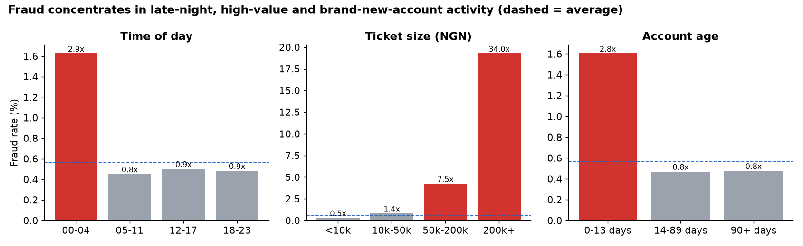
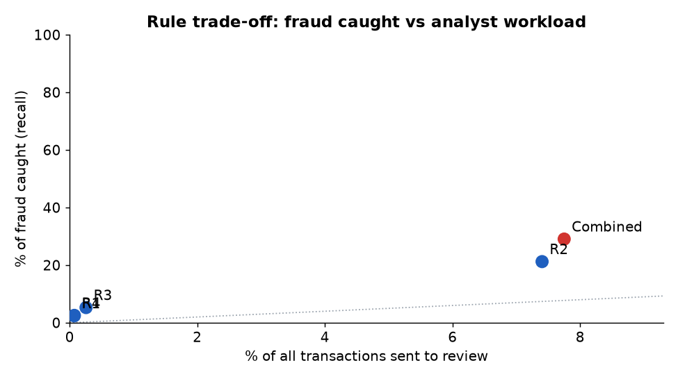

# Transaction Fraud Analysis - from raw data to a rule recommendation

**Business question:** *Where does fraud concentrate in our payments flow, and which low-friction rules catch the most of it for the least analyst workload?*

This is a data-storytelling project: SQL (DuckDB) for the analysis, Python for the charts, and a decision-oriented write-up. **Read the full story in [`REPORT.md`](REPORT.md).**

## The answer in 30 seconds
- 117k transactions, 664 fraud cases (0.57% of count, **2.07% of value**).
- Fraud is **~3x** more likely at 00:00-04:59 and for accounts under 14 days old, and `card_online` is the riskiest rail.
- Four simple rules catch **29%** of fraud while reviewing **7.7%** of traffic; two of them are precise enough (~19%) to auto step-up-authenticate at ~0.07% of traffic each.
- Rules alone miss ~71% of fraud, which makes the case for a model as the next step.




## What this demonstrates
| Skill | Evidence |
|---|---|
| Business framing | one question, one recommendation, quantified trade-off |
| SQL | segmentation with `CASE`, joins, aggregates and `date_diff` in DuckDB; lift computed against the base rate |
| Metrics fluency | lift, precision, recall, review rate - the language of fraud/risk teams |
| Visual storytelling | red highlights only where lift > 2x, dashed baseline, annotated lift labels |
| Honesty | caveats section on synthetic data and circularity of the amount signal |

## Reproduce
```bash
pip install -r requirements.txt
python src/gen_data.py --out data/raw
python src/analysis.py        # regenerates figures/ and REPORT.md
```
Every number in `REPORT.md` is computed by the script - nothing is typed by hand.
