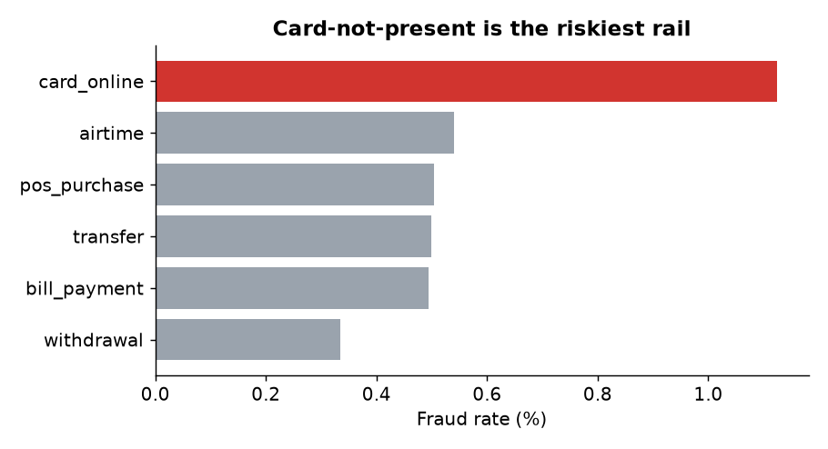

# Fraud analysis - findings (auto-generated from the data)

**Scope:** 117,188 transactions, 664 confirmed fraud (0.57%), worth NGN 25.9m of NGN 1,253m processed (2.07% of value).

## Key findings
1. **Late-night is the strongest time signal.** Transactions in the `00-04` window are 2.9x more likely to be fraud than average.
2. **Ticket size matters.** `200k+` transactions run at 34.0x the average fraud rate.
3. **New accounts are the riskiest cohort.** `0-13 days` accounts are 2.8x the average.
4. **Rail matters.** `card_online` has the highest fraud rate (1.13%).

## Rule candidates
| rule | flagged | caught | precision_pct | recall_pct | flag_rate_pct |
|---|---|---|---|---|---|
| R1  amount >= 200k | 83 | 16 | 19.28 | 2.41 | 0.07 |
| R2  00-04h | 8,676 | 141 | 1.63 | 21.23 | 7.40 |
| R3  account < 14d AND amount >= 50k | 301 | 35 | 11.63 | 5.27 | 0.26 |
| R4  card_online AND amount >= 100k | 86 | 17 | 19.77 | 2.56 | 0.07 |
| ALL rules combined (OR) | 9,082 | 193 | 2.13 | 29.07 | 7.75 |

The combined rule set catches **29%** of fraud while sending only **7.7%** of traffic to review (precision 2.1% vs a 0.57% base rate, a 4x improvement over random review).

## Recommendation
- **High-precision, low-friction rules first:** R1 and R4 flag only 0.07% / 0.07% of traffic at ~19% precision - safe to step-up authenticate (OTP) automatically rather than hard-decline.
- **Treat the night-time rule (R2) as a score feature, not a block:** it has the best recall (21%) but only 1.6% precision on 7.4% of traffic - too noisy to action alone.
- **Rules alone are not enough:** even combined they miss 71% of fraud, which is the business case for a model.
- Review queue sizing: the combined set implies ~17 alerts/day (over the 545-day window) - size analyst headcount accordingly.
- Next iteration: replace static thresholds with a gradient-boosted model and track precision decay weekly.

## Caveats
Synthetic data: the risk factors above were *designed into* the generator, so the point of this project is the **method** (segmentation, lift, rule evaluation, trade-off framing), not the specific numbers. The large `200k+` lift is partly circular - fraudulent amounts are inflated in the generator - so in production, validate amount rules against *pre-fraud* behaviour (e.g. deviation from the customer's own history).
